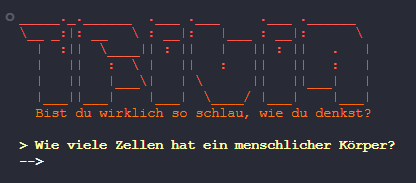
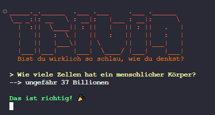
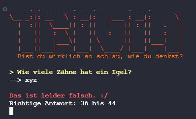

# Trivia Game
Ein einfaches Trivia Spiel für das Terminal.

## Quickstart
- Repository clonen
- `trivia.py` ausführen
- Spielen

**Weitere Fragen können in der `fragen.json`-Datei hinzugefügt werden!**

## Screenshots
### Main Screen

### Richtige Antwort

### Falsche Antwort
